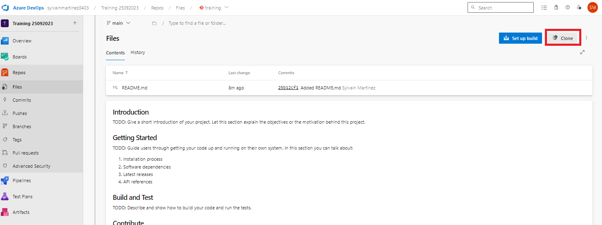
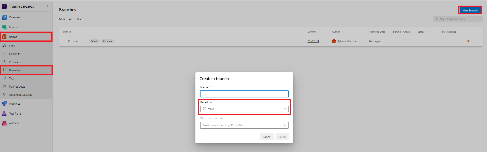
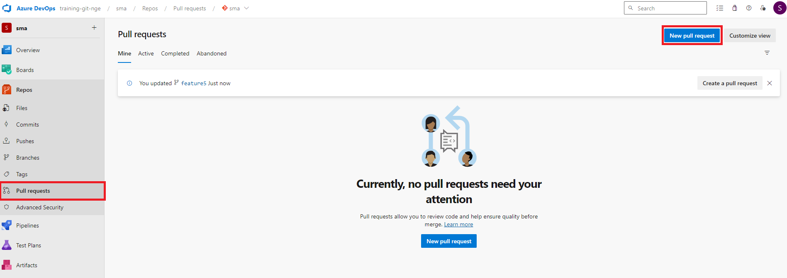
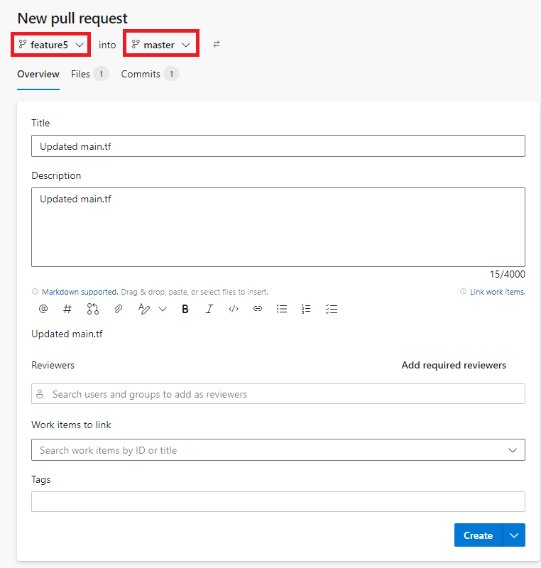
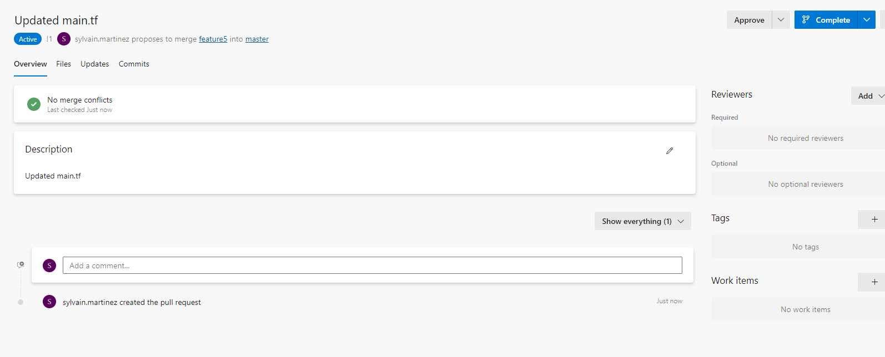

# Travailler avec Azure DevOps

## Overview

Dans ce lab, vous allez utiliser Azure DevOps.

## Objectives

Après la complétion de ce lab, vous pourrez :

-   Pousser un repository existant vers Azure DevOps.
-   Cloner un repository depuis Azure DevOps.
-   Créer une Pull Request.
-   Consulter l'historique dans Azure DevOps.

## Instructions

### Avant de commencer

- Avoir dérouler le lab **Travailler avec les branches**.
- Avoir un compte Azure DevOps

### Exercice 1: Pousser un repository existant

Récuperez l'url de votre repository dans Azure DevOps.



> Copier l'Url, nous en aurons besoin pour pouvoir cloner localement le repository.

Dans le shell de votre choix, aller dans le dossier contenant votre repository git.

```shell
cd trainingrepo
```

Executer les commandes git

```shell
git remote add origin <l'url de votre projet git>
git push --set-upstream origin --all
```

> Le repository est maintenat poussé sur Azure DevOps

> L'ensemble des branches et de l'historique est disponible

> Azure DevOps permet de voir l'historique de chaque branche, avec le détails des modifications

### Exercice 2: Cloner un repository

Remontez d'un niveau dans l'arboresence par rapport à votre repository local.

```shell
cd ..
```

Lancer la commande

```shell
git clone <l'url de votre projet git>
cd <le nom de votre repository>
git status
```

> Le projet git est récupérer depuis Gitlab

### Exercice 3: Créer une branche dans Azure DevOps et la récupérer localement

Créez une nouvelle branche sur Azure DevOps.



Cette branche est créée depuis *master* et s'appele *feature4*.

Dans votre shell, dans le dossier ou est cloné le repo, lancer la commande suivante

```shell
git branch -a
```

> La branche feature4 n'apparait pas pour l'instant

Lancer les commandes suivante

```shell
git fetch
git branch -a
```

> La branche feature4 apparait maintenant

```shell
git checkout --track origin/feature4
```

> Vous avez récuperer localement la branche feature4 et vous pouvez maintenant travailler dessus.

### Exercice 4: Créer une branche localement et la pousser vers Azure DevOps

Dans votre shell, dans le dossier ou est cloné le repo, lancer la commande suivante

```shell
git status
```

Si vous n'êtes pas sur la branche *main*, executez la commande suivante

```shell
git checkout main
```

Créez une branche *feature5*, à partir de la branche maine.

```shell
git checkout -b feature5
```

> Cette branche existe uniquement dans votre repository local, pas en remote. Vous pouvez vérifier sur Azure DevOps qu'elle n'est pas présente.

Nous allons pousser cette branche locale vers Azure DevOps

```shell
git push --set-upstream origin feature5
```

> La existe maintenant localement dans votre repository et également en remote.


### Exercice 5: Modifier localement une branche et pousser vers Azure DevOps

Modifiez le fichier readme.md et créez un commit

```shell
git add .
git commit -m "update readme"
git status
```

> Le commande status nous indique que nous avons un commit local qui doit être poussé en remote

Lancez la commande git

```shell
git push
git status
```

> La branche local et la branche en remote sont à jour

### Exercice 6: Créer une Pull Request dans Azure DevOps

Modifiez le fichier Readme.md et créez un commit sur la branche *feature5*

```shell
git add .
git commit -m "update readme"
git status
```

> Le commande status nous indique que nous avons un commit local qui doit être poussé en remote

Lancez la commande git

```shell
git push
git status
```

> La branche local et la branche en remote sont à jour

Dans le portail Azure DevOps, créer une Pull Request



Selectionnez la branche source et la branche de destination



Cliquez sur *Create*

La Pull Request est créée



> Il est possible de consulter l'ensemble des commits et les modifications contenus dans la Pull Request

> Il est possible également de demander la relecture en configurant les reviewers

> Il est possible de protéger certaines branches, pour qu'elles ne supportent pas un push, mais uniquement une écriture via des Pull Requests.

> Un pipeline peut également être configuré pour s'éxecuter automatiquement lors de la création d'une Pull Request. La possibilité de réaliser l'opération de merge est conditionnée par l'éxecution de ce pipeline (tests unitaires, tests d'intégrations, analyse statique de code ...)

Cliquez sur *Complete*, puis *Complete and Merge*

